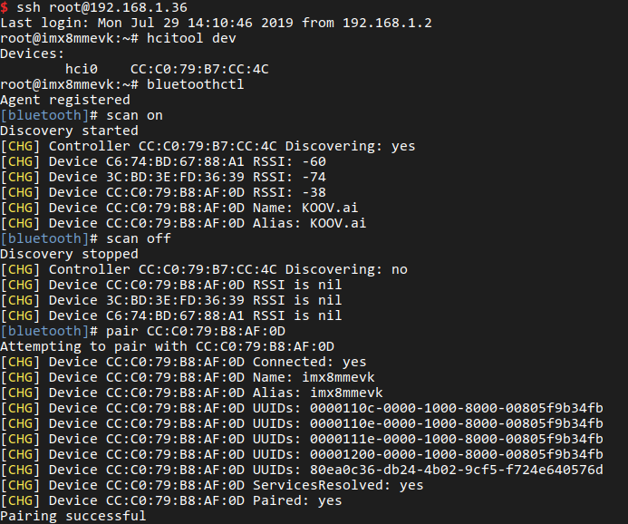
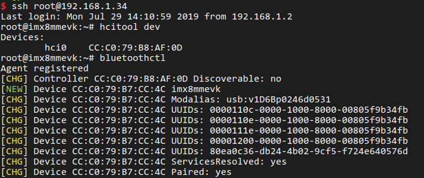
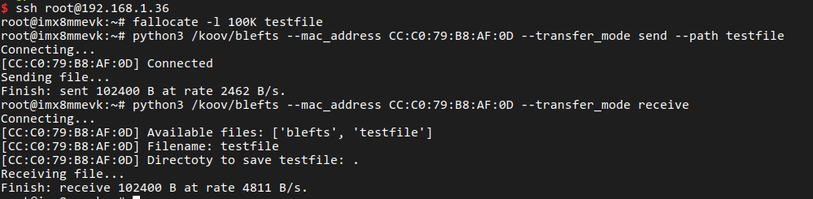

# Instruction
_This instruction is implemented on 2 boards, one for BLE GATT server and the other for BLE GATT client._

## Flash firmware

- [Download firmware](https://drive.google.com/drive/u/2/folders/1ALvffYrLl4PT4mdGKbNhNYRVr5ozzhsX).
- Extract it:
  - bunzip2 -k -f koov-image-imx8mmevk.sdcard.bz2
- Flash firmware into sdcard:
  - sudo dd if=koov-image-imx8mmevk.sdcard of=/dev/sdX bs=1M && sync

## Setup Wifi (optional)
- Connect 2 boards to PC via serial debug port (microUSB port).
- Connect 2 boards to your wifi AP;
  - wpa_passphrase SSID PASSWORD >> /etc/wpa_supplicant/wpa_supplicant-nl80211-wlan0.conf
  - systemctl restart wpa_supplicant-nl80211@wlan0.service

## Setup BLE GATT server and BLE GATT client
- Firmware already contains both server (**blekoov**) and client tool (**blefts**).
- For the board plays server role: **blekoov** is started automatically so nothing needed more.
- For the board plays client role: need to disable **blekoov**:
  - systemctl disable blekoov
  - reboot

## Pair
- Two boards need to paired each other manually by **bluetoothctl**.
- BLE GATT client:
  - bluetoothctl
  - scan on
  - pair SERVER:MAC:ADDRRESS

  
- BLE GATT server:

  

## Transfer file
_Both send/receive actions are implemnented on the client board._
- In server side, all files, transfered, will be save in **/koov** directory.
- **blefts** - tool for transferring be also in the **/koov** directory.
- For sending file to server:
  - python3 /koov/blefts --mac_address SERVER:MAC:ADDRRESS --transfer_mode send --path path_to_file
- For receiving file from server:
  - python3 blefts --mac_address SERVER:MAC:ADDRRESS --transfer_mode receive

